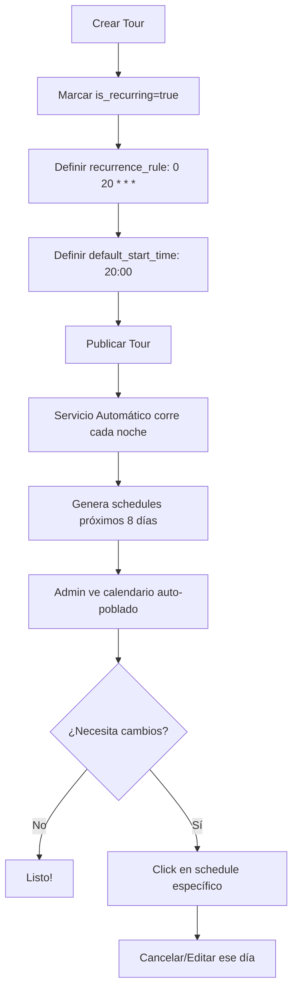
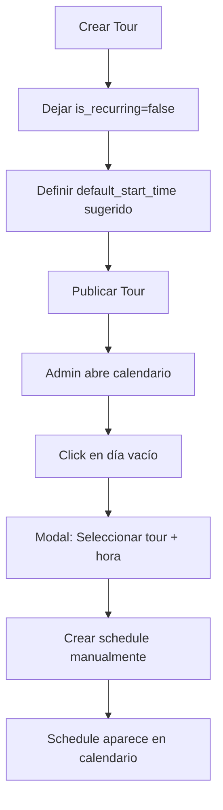

# Arquitectura de Gestión de Schedules

## Situación Actual

### Modelo de Datos Existente

Ya tienes definido:
- **`tours`**: Catálogo de tours con `is_recurring` y `recurrence_rule` (cron)
- **`tour_schedules`**: Instancias específicas con `start_datetime`, `max_participants`, `status`
- **`owner_id`**: Cada tour pertenece a un usuario (Alex o David)

### Casos de Uso Identificados

#### **Caso A: Alex - Tours Recurrentes Automáticos**
- Todos sus tours astronómicos se repiten diariamente
- Mismo horario (aún no definido, ej: 20:00)
- Generación automática de schedules
- Solo necesita **gestión por excepción** (cancelar días específicos)

#### **Caso B: David - Tours Manuales**
- Trabaja solo fines de semana
- Quiere **crear manualmente** cada instancia
- Horarios variables según disponibilidad
- Control total sobre cuándo opera

---

## Problemas a Resolver

### 1. **Horarios de Tours No Definidos**

**Estado actual:**
- `tours.duration_hours` existe (duración)
- `tour_schedules.start_datetime` existe (fecha + hora específica)
- ❌ NO existe un "horario predeterminado" en `tours`

**Propuesta:**
Agregar a la tabla `tours`:
```sql
ALTER TABLE tours ADD COLUMN default_start_time TIME; -- ej: '20:00:00'
```

**Justificación:**
- Para tours recurrentes: Se usa como base para generar `tour_schedules.start_datetime`
- Para tours manuales: Es solo una sugerencia, el admin puede ignorarla
- Ejemplo: "Tour Astronómico" tiene `default_start_time = '20:00:00'`

### 2. **Generación Automática vs Manual**

**Solución: Sistema Híbrido**

#### **A. Servicio de Generación Automática** (Backend)
```java
@Service
@Scheduled(cron = "0 0 2 * * *") // Se ejecuta a las 2 AM diariamente
public class TourScheduleGeneratorService {

    public void generateSchedulesForNext8Days() {
        LocalDate today = LocalDate.now();
        LocalDate endDate = today.plusDays(8);

        // Solo tours recurrentes publicados
        List<Tour> recurringTours = tourRepository
            .findByRecurringTrueAndStatus("PUBLISHED");

        for (Tour tour : recurringTours) {
            for (LocalDate date = today; date.isBefore(endDate); date = date.plusDays(1)) {
                // Verificar si coincide con recurrence_rule (cron)
                if (matchesCronRule(date, tour.getRecurrenceRule())) {
                    // Verificar si YA existe un schedule para esta fecha
                    boolean exists = scheduleRepository
                        .existsByTourIdAndDate(tour.getId(), date);

                    if (!exists) {
                        // Verificar restricciones de negocio
                        if (isDateValid(tour, date)) {
                            createScheduleInstance(tour, date);
                        }
                    }
                }
            }
        }
    }

    private boolean isDateValid(Tour tour, LocalDate date) {
        // Restricción luna llena para tours astronómicos
        if (tour.isMoonSensitive() && lunarService.isFullMoon(date)) {
            return false;
        }

        // Restricción viento para tours sensibles
        if (tour.isWindSensitive() && weatherService.isWindy(date)) {
            return false;
        }

        return true;
    }

    private void createScheduleInstance(Tour tour, LocalDate date) {
        LocalTime startTime = tour.getDefaultStartTime(); // ej: 20:00
        ZonedDateTime startDateTime = ZonedDateTime.of(
            date,
            startTime,
            ZoneId.of("America/Santiago")
        );

        TourSchedule schedule = new TourSchedule();
        schedule.setTourId(tour.getId());
        schedule.setStartDatetime(startDateTime);
        schedule.setMaxParticipants(tour.getDefaultMaxParticipants());
        schedule.setStatus("OPEN");

        scheduleRepository.save(schedule);
    }
}
```

**Características clave:**
- ✅ Se ejecuta automáticamente cada noche
- ✅ Genera schedules para los próximos 8 días (límite OpenWeatherMap One Call API 3.0)
- ✅ NO sobreescribe schedules existentes (respeta cambios manuales)
- ✅ Aplica reglas de negocio (luna, viento, nubosidad)
- ✅ Solo procesa tours con `is_recurring = true`

#### **B. Creación Manual** (Frontend Admin)
Para David y casos especiales:
- Botón "Crear Schedule Manual" en el calendario
- Modal donde selecciona:
  - Tour
  - Fecha
  - Hora (pre-rellenada con `default_start_time` si existe)
  - Max participantes (pre-rellenado con `default_max_participants`)
- Crea directamente en `tour_schedules`

---

## Diseño de la Interfaz de Calendario

### Requisitos UX

1. **Vista de 8 Días Adelante**
   - Rango fijo: HOY → +8 días (límite OpenWeatherMap One Call API 3.0)
   - Solo lectura/edición, no navegación al pasado

2. **Gestión de Schedules**
   - Ver todos los schedules en un vistazo
   - Click en schedule → Editar/Cancelar
   - Click en espacio vacío → Crear nuevo
   - Indicadores visuales:
     - 🟢 OPEN (disponible)
     - 🔴 CLOSED (cupos llenos)
     - ⚫ CANCELLED (cancelado)
     - 🌕 Luna llena (no astronómicos)
     - 💨 Viento alto (tours sensibles)

3. **Diferenciación de Tours**
   - Color por categoría o owner
   - Badge con nombre del tour
   - Tooltip con detalles (cupos, reservas actuales)

### Componente Recomendado: FullCalendar

**Opción 1: @fullcalendar/vue3** ⭐ Recomendado
```bash
npm install @fullcalendar/vue3 @fullcalendar/core @fullcalendar/daygrid @fullcalendar/timegrid @fullcalendar/interaction
```

**Ventajas:**
- Vista de agenda natural
- Drag & drop para cambiar horarios
- Eventos cliqueables/editables
- Integración con Nuxt UI (estilos personalizables)
- Soporte para eventos recurrentes
- Vista de 8 días fácil de configurar

**Alternativa: Qalendar** (más ligero, Vue-first)
```bash
npm install qalendar
```

---

## Flujo de Trabajo Propuesto

### Para Alex (Tours Recurrentes)



### Para David (Tours Manuales)



---

## Propuesta de Migración

### 1. Agregar Campo de Horario
```sql
-- Migration: V2__Add_default_start_time.sql
ALTER TABLE tours
ADD COLUMN default_start_time TIME DEFAULT '20:00:00';

-- Actualizar tours existentes con horario razonable
UPDATE tours
SET default_start_time =
    CASE
        WHEN category = 'ASTRONOMICAL' THEN '20:00:00'
        WHEN category = 'REGULAR' THEN '09:00:00'
        ELSE '10:00:00'
    END;
```

### 2. Endpoints Backend Necesarios

```java
// GET /api/admin/schedules?start=2025-11-01&end=2025-11-08
// Retorna todos los schedules en el rango para el calendario

// POST /api/admin/schedules
// Crear schedule manual (para David)
{
  "tourId": "uuid",
  "startDatetime": "2025-11-05T20:00:00-03:00",
  "maxParticipants": 15
}

// PATCH /api/admin/schedules/{id}
// Editar schedule existente (cambiar hora, cupos, etc.)

// DELETE /api/admin/schedules/{id}
// Cancelar schedule (cambia status a CANCELLED)

// POST /api/admin/schedules/generate
// Trigger manual del generador (útil para testing)
```

### 3. Componente Vue del Calendario

```vue
<!-- pages/admin/calendar.vue -->
<template>
  <div class="p-6">
    <h1 class="text-2xl font-bold mb-4">Calendario de Tours</h1>

    <FullCalendar
      :options="calendarOptions"
      @eventClick="handleEventClick"
      @dateClick="handleDateClick"
    />

    <!-- Modal para crear/editar schedule -->
    <UModal v-model:open="isModalOpen">
      <!-- Formulario de schedule -->
    </UModal>
  </div>
</template>

<script setup>
const calendarOptions = {
  plugins: [dayGridPlugin, timeGridPlugin, interactionPlugin],
  initialView: 'timeGridEightDay', // Vista personalizada de 8 días
  validRange: {
    start: new Date(), // Hoy
    end: addDays(new Date(), 8) // +8 días
  },
  events: async (info) => {
    // Cargar schedules del backend
    const schedules = await $fetch(`/api/admin/schedules`, {
      params: {
        start: info.startStr,
        end: info.endStr
      }
    });

    return schedules.map(s => ({
      id: s.id,
      title: s.tour.name,
      start: s.startDatetime,
      end: addHours(s.startDatetime, s.tour.durationHours),
      backgroundColor: getColorByStatus(s.status),
      extendedProps: s // Datos completos
    }));
  }
};
</script>
```

---

## Decisiones Arquitectónicas Clave

### ✅ Ventajas de Este Enfoque

1. **Flexibilidad Total**
   - Alex: Automatización completa
   - David: Control manual
   - Ambos: Pueden editar lo que necesiten

2. **Sin Conflictos**
   - El generador automático respeta schedules existentes
   - Nunca sobreescribe cambios manuales

3. **Escalable**
   - Agregar más partners con sus propias reglas
   - Diferentes horarios por tour
   - Horarios estacionales (verano/invierno)

4. **Gestión por Excepción**
   - Alex solo interviene para cancelar días específicos
   - 95% del trabajo es automático

### ⚠️ Puntos a Definir

1. **Horarios Específicos**
   - ¿A qué hora empiezan los tours astronómicos? (Sugerencia: 20:00)
   - ¿A qué hora los regulares? (Sugerencia: 09:00)
   - ¿Variaciones estacionales?

2. **Ventana de Generación**
   - 8 días definido por límite de OpenWeatherMap One Call API 3.0
   - ¿Permitir bookings más allá de 8 días?

3. **Restricciones de Validación**
   - ✅ Viento: 25 nudos (ya definido)
   - ✅ Luna llena: moon_phase entre 0.45-0.55 (ya definido)
   - ✅ Nubosidad: >80% de nubes (ya definido)

---

## Próximos Pasos

1. ✅ **Definir horarios por defecto** de cada tipo de tour
2. ⬜ **Migración de BD** para agregar `default_start_time`
3. ⬜ **Implementar servicio generador** automático
4. ⬜ **Crear endpoints de API** para gestión de schedules
5. ⬜ **Integrar componente de calendario** en frontend
6. ⬜ **Testing** con datos reales de Alex y David
